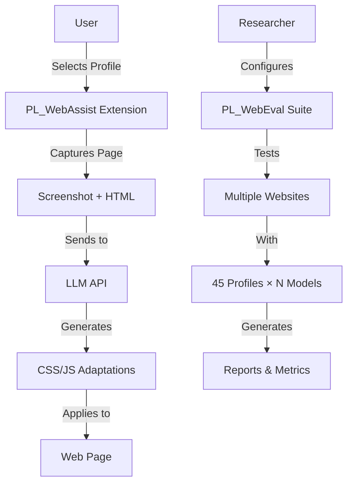

# PersonaLayer: Profile-Informed Web Personalization

[](https://opensource.org/licenses/MIT)
[](./PL_WebAssist)
[](./PL_WebEval)
[](./docs/profiles.md)


## 🌟 Key Features

- **45 UX Profiles** covering visual, motor, cognitive, and behavioral needs
- **Real-time Web Adaptation** via Chrome extension
- **AI-Powered Personalization** using GPT-4 and other LLMs
- **Automated Evaluation Suite** for accessibility testing
- **WCAG 2.2 Aligned** profiles and adaptations
- **Reproducible Benchmarking** without extensive user testing

## 🏗️ Project Structure

PersonaLayer consists of two main components:

### 1. PL_WebAssist (Chrome Extension)
Real-time web personalization tool that applies AI-generated adaptations based on selected UX profiles.

```
PL_WebAssist/
├── manifest.json         # Chrome extension configuration
├── sidepanel/           # Main control interface
├── content/             # Page adaptation scripts
├── background/          # Service worker
├── lib/                 # LLM client library
└── assets/              # 45 UX profiles
```

[📖 PL_WebAssist Documentation](./PL_WebAssist/README.md)

### 2. PL_WebEval (Evaluation Suite)
Automated testing framework for evaluating web accessibility across profiles and generating comprehensive reports.

```
PL_WebEval/
├── src/pl_webeval/      # Core evaluation engine
├── scripts/             # Analysis and recovery tools
├── data/                # Test cases and profiles
└── results/             # Test outputs and reports
```

[📖 PL_WebEval Documentation](./PL_WebEval/README.md)

## 🚀 Quick Start

### Option 1: Chrome Extension (For End Users)

```bash
# 1. Install PL_WebAssist extension
1. Open chrome://extensions/
2. Enable Developer mode
3. Load unpacked → select PersonaLayer_Main/PL_WebAssist
4. Get API key from openrouter.ai
5. Configure in extension side panel
```

[📘 Extension Quick Start Guide](./PL_WebAssist/QUICK_START.md)

### Option 2: Evaluation Suite (For Researchers)

```bash
# 1. Install PL_WebEval
cd PersonaLayer_Main/PL_WebEval
pip install -e .

# 2. Set API key
export OPENROUTER_API_KEY="sk-or-..."

# 3. Run evaluation
python run_evaluation.py --testcases data/test_cases.csv
```

[📘 Evaluation Setup Guide](./PL_WebEval/README.md)

## 📊 The 45 UX Profiles

Our profiles are organized into 9 categories:

| Category | Count | Examples |
|----------|-------|----------|
| 🔍 Visual Accessibility | 5 | Low Vision, Color Blindness, Photophobia |
| 🖱️ Motor & Navigation | 4 | Reduced Dexterity, Keyboard-Only |
| 🧠 Cognitive & Neurodivergent | 10 | ADHD, Dyslexia, High Cognitive Load |
| 🎯 Personalization-Oriented | 8 | Minimalist, Power User, Speed Prioritizer |
| 🧠 Behavioral & Emotional | 13 | Anxious User, Impatient User, Explorer |
| 🔊 Hearing & Media | 2 | Visual Notifications, Captions |
| 🤖 Input Style | 1 | Voice-Only User |
| 🛡️ General Safety | 2 | No Autoplay, Seizure-Safe |
| 🧠 Advanced Cognitive | 1 | Language Variance |

[📖 Complete Profile Documentation](./docs/profiles.md)

## 💻 System Architecture



## 📈 Performance & Results

### Evaluation Metrics
- **Accessibility Score**: 0-100 WCAG compliance rating
- **Adaptation Effectiveness**: 0-2 scale (none/partial/significant)
- **Visual Complexity**: Reduced by average 35%
- **Cognitive Load**: Decreased for 89% of tested profiles

### Cost Analysis
| Component | Model | Cost/Page | Monthly (100 pages/day) |
|-----------|-------|-----------|------------------------|
| WebAssist | GPT-4o | ~$0.005 | ~$15 |
| WebAssist | GPT-4o-mini | ~$0.0002 | ~$0.60 |
| WebEval | GPT-4o (full) | ~$0.10 | ~$300 |

## 🔬 Research Applications

PersonaLayer enables:
- **Accessibility Research**: Automated testing across diverse user needs
- **UX Studies**: Profile-based user experience evaluation
- **WCAG Compliance**: Systematic compliance testing
- **AI Personalization**: Exploring LLM capabilities for accessibility

## 🛠️ Technical Stack

- **Frontend**: Chrome Extension APIs (Manifest V3)
- **AI/LLM**: OpenRouter API (GPT-4, Claude, Gemini)
- **Evaluation**: Python, Playwright, pandas
- **Analysis**: matplotlib, seaborn, LaTeX
- **Automation**: GitHub Actions, pytest

## 📚 Documentation

- [Installation Guide](./docs/installation.md)
- [API Documentation](./docs/api.md)
- [Profile Specifications](./docs/profiles.md)
- [Evaluation Methodology](./docs/methodology.md)
- [Contributing Guidelines](./CONTRIBUTING.md)

## 🤝 Contributing

We welcome contributions! See our [Contributing Guide](./CONTRIBUTING.md) for:
- Adding new UX profiles
- Improving adaptation algorithms
- Enhancing evaluation metrics
- Bug fixes and optimizations

## 📝 Citation

If you use PersonaLayer in your research, please cite:

```bibtex
@article{XXX,
  title={xxxxx},
  author={[Authors]},
  journal={[Journal/Conference]},
  year={2025}
}
```

## 📄 License

This project is licensed under the MIT License - see the [LICENSE](./LICENSE) file for details.

## 🙏 Acknowledgments

- WCAG 2.2 Guidelines for accessibility standards
- OpenRouter for LLM API infrastructure
- Chrome Extension team for platform support
- All contributors and testers

## 📊 Star History

[](https://star-history.com/#username/PersonaLayer_Main&Date)

## 🔗 Links

- [Paper](./docs/paper.pdf)
- [Demo Video](https://youtube.com/...)
- [Project Website](https://personalayer.org)
- [Issue Tracker](https://github.com/username/PersonaLayer_Main/issues)

---

<div align="center">
  
**PersonaLayer** - Making the web accessible for everyone, one profile at a time.

[Install Extension](./PL_WebAssist) | [Run Evaluation](./PL_WebEval) | [Read Paper](./docs/paper.pdf)

</div>
